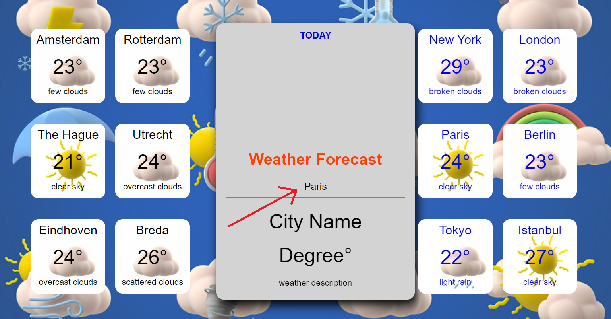
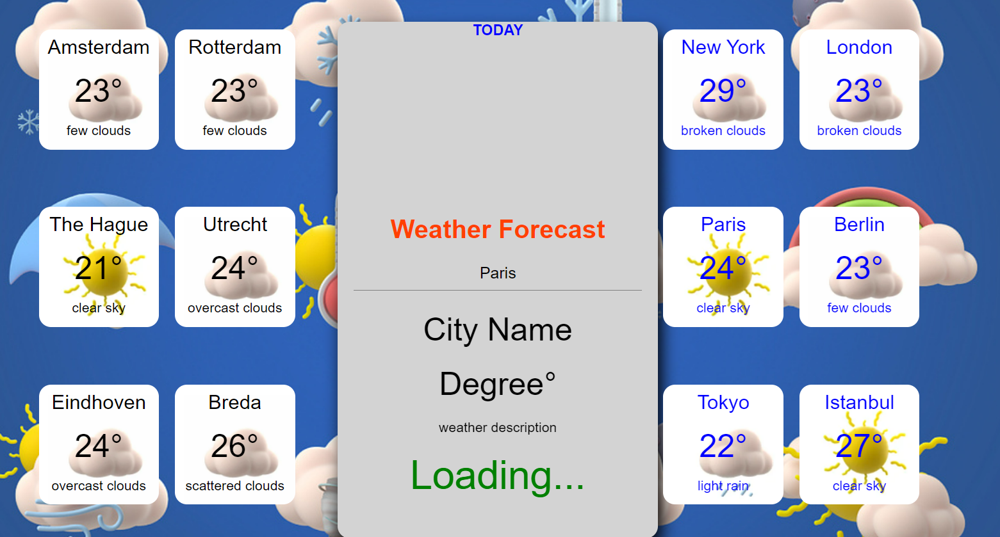
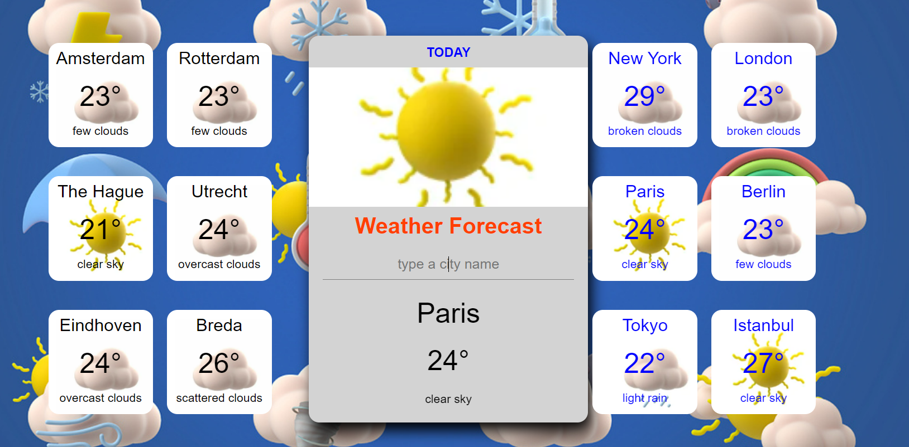

# WeatherApp


WeatherApp is a simple application designed to provide users with weather information for various cities around the world. Users can input a city name and get real-time weather data along with a relevant background image for the searched city. Additionally, the app displays a list of predefined local and international cities for quick access to weather information.

[View live demo](https://mustafadurmusnl.github.io/weatherApp/)

## Demo

### Step 1: Input a City Name

*Enter a city name in the search box.*

### Step 2: Loading Animation

*A loading animation is displayed while fetching weather data.*

### Step 3: Weather Information

*Display of weather information for the selected city.*

## Features

- **City Search:** Users can input any city name to retrieve weather information.
- **Dynamic Backgrounds:** Each city search sets a relevant background image reflecting the city's atmosphere or landmarks.
- **Predefined Cities:** Displays weather information for a set of local and international cities.
- **Responsive Design:** Designed to be user-friendly on both desktop and mobile devices.

## Technologies Used

- **Frontend:** HTML, CSS, JavaScript
- **Backend/API:** OpenWeatherMap API (or any other weather API you're using)
- **Additional Libraries:** (List any additional libraries or frameworks used, e.g., Bootstrap for styling)

## How to Use

1. **Installation:**
   - Clone the repository: `git clone https://github.com/yourusername/weatherApp.git`
   - Navigate to the project directory: `cd weatherApp`

2. **Configuration:**
   - Obtain an API key from OpenWeatherMap (or your chosen weather API provider).
   - Create a `.env` file in the root directory and add your API key:
     ```
     API_KEY=your_api_key_here
     ```

3. **Running the App:**
   - Open `index.html` in your preferred web browser.

4. **Usage:**
   - Enter a city name in the search box and press Enter or click the search button.
   - The app will display the current weather information (temperature, humidity, etc.) for the searched city.
   - A relevant background image will be set based on the searched city.

## Screenshots

(Include additional screenshots of your application in action, showcasing different city searches and their corresponding backgrounds.)

## Credits

- **OpenWeatherMap API:** Used for retrieving weather data.
- **Background Images:** Sources for the city background images used in the app.
